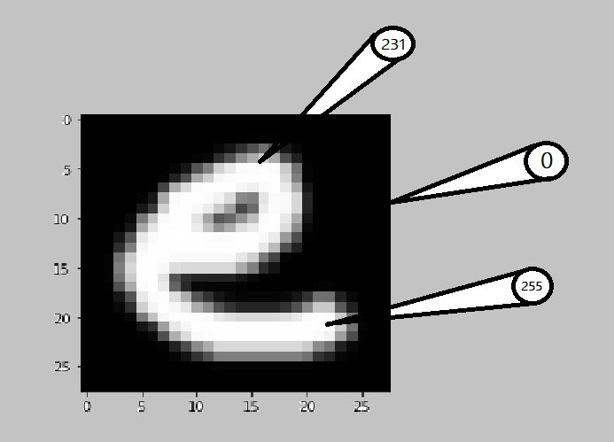

# Alphabet-Recognisation-Using-Hand-Gesture

## Overview 
This is a simple app to predict the alphabet that is written on screen using an object-of-interest ( a red pen ). Screen act as if like a blackboard . Model is trained on the top of Keras API.   
 
## Working Example  

## Technical Aspects 
The Project is divided into three parts: 
  1-> Make a model using EMNIST Alphabet dataset using Keras to predict the alphabet. 
  2-> Take the reference of red colour to draw on the screen . and using a deque to store the point of location where the red coloured object  is moving  and finally predict the alphabet . 
  3-> Adding a feature of sound ( to speak the predicted alphabet) . 
  
## YouTube Video (Explanation and demo)

## Code Requirements  
The code is written in python 3.7 .If you have a lower version of Python you can upgrade using the pip package , ensuring you have the latest version of pip . 
To install the required Packages and libraries , run the command in the project directory after cloning the repository. 

### pip install -r requirements.txt
 

## Data Description  
The "Extended Hello World" of object recognition for machine learning and deep learning is the EMNIST dataset for handwritten letters recognition. It is an extended version of the MNIST dataset. 

## Code Explanation  
 I have written a tutorial <a href="https://helloml.org/alphabet-recognition-using-hand-gestures"> post on hello ML </a>explaining the code.  

The small portion of the dataset is shown below.
 

Each of the letters is stored as a numbered array(28 x 28) as shown below.

 
 ## Code Execution  
 After following the above steps of installation . Open the terminal( cmd, powershell ) in the project directory and use the command   
 ### python Hand Gesture Implementation.py  
